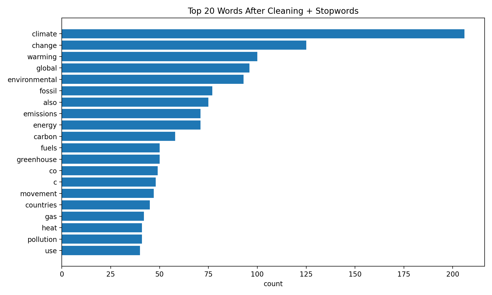

# Text-Analysis-Project

Please read the [instructions](instructions.md).

## 1. Project Overview (~1 paragraph)
For this project, I collected text from four Wikipedia pages related to climate change: “Climate change,” “Global warming controversy,” “Fossil fuel industry,” and “Environmental movement.” I used Python to fetch and cache the text, clean and tokenize it, remove stopwords, compute word frequencies, and calculate TF-IDF scores to identify which words are most unique to each article. The goal was to understand how different parts of the climate change discussion are framed across different types of discourse. I also noticed several connections to my Quantitative Machine Learning course, particularly with text mining in R (tokenization, frequency tables, and TF-IDF). This project gave me the chance to implement similar analysis techniques in Python, which felt more intuitive and straightforward to control step-by-step. It was interesting to see how two different tools can solve the same problem in slightly different ways.

## 2. Implementation (~1-2 paragraphs)
My project is organized into two main Python files.  
**part01.py** fetches and harvests the articles from Wikipedia using the `mediawiki` library and saves them as local JSON files to avoid downloading the same data repeatedly. This step was important because it made testing faster and avoided unnecessary API calls. 
**part02.py** handles all text processing. I used regular expressions to tokenize the text and remove citation brackets. I used NLTK’s English stopword list to remove common filler words so I don't need to download any. Word frequencies were stored in Python dictionaries (histograms). For TF-IDF, I implemented the calculation manually using dictionary counts, total token length per document, and inverse document frequency across documents. This followed the algorithm we studied in class.

One design decision I made was to store all the Wikipedia page titles in a single `topics` list rather than hard-coding them into multiple parts of the code or a specific Url imported. This allows the project to be reused easily with different text sources. If I want to analyze new topics, I only need to update the list, and the rest of the pipeline (fetching, cleaning, tokenizing, and analysis) will still work without any code changes. This design choice made the system more flexible and easier to maintain. I used AI to help with polish my data to make it more precise and the visualization and sentiment socre part of the project. I already understood the purpose of word clouds and bar charts from doing similar text mining work in RStudio in my Quantitative Machine Learning course, but I did not know how to generate those visualizations in Python. I provided ChatGPT with examples of the plots I had previously created in R, and asked how to produce the same type of graphs using Python. The AI mainly helped me translate the steps I already understood into Python code, rather than deciding the analysis for me.

## 3. Results (~1-3 paragraphs + figures/examples)
After cleaning and tokenizing the four articles, I ran word frequency analysis to identify the most common terms across the combined corpus. Unsurprisingly, the words “climate,” “change,” “warming,” and “global” appeared most frequently, reflecting how central these concepts are to the broader climate discourse. However, the frequency charts also revealed thematic differences among the pages. For example, the Fossil fuel industry page emphasized terms like “fossil,” “fuels,” “oil,” and “coal,” while the Environmental movement page highlighted “pollution,” “conservation,” and “nuclear.” These differences align well with the distinct focus and goals of each page.

## 4. Reflection (~1-2 paragraphs)
The Climate change and Environmental movement pages emphasize scientific and collective-action language, focusing on emissions, warming, and sustainability.
The Fossil fuel industry page highlights corporate and economic terminology, such as operations, coal, and production.
The Global warming controversy page uses argument- and debate-oriented vocabulary like skeptics, evidence, and consensus, indicating rhetorical struggle and ideological polarization.
